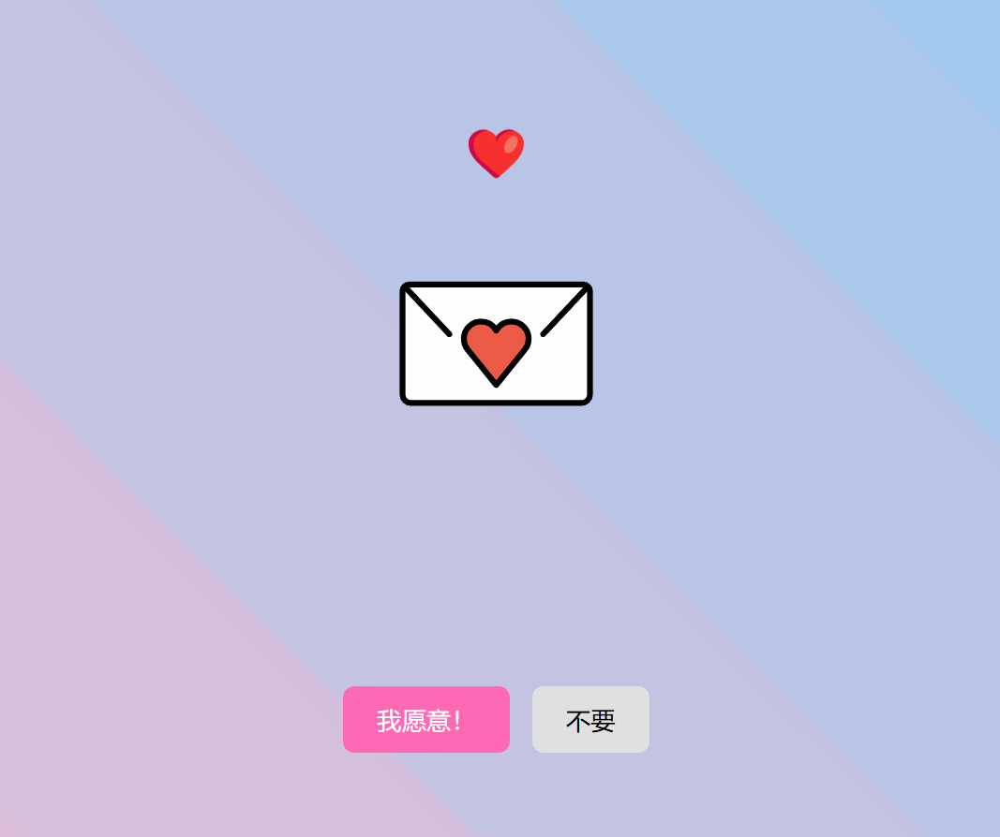

# 💖 互动式网页表白神器 [](https://vuejs.org/) [](https://opensource.org/licenses/MIT)

✨ 抖音同款爆火互动页面复刻版 | 支持深度定制 | 程序员浪漫必备

<p align="center">
  
  
  
</p>

## 🎮 在线体验

[](https://your-demo-link.com)
*推荐使用移动端访问，体验更佳*

## 🛠️ 快速启动

```bash
# 推荐使用pnpm
pnpm install && pnpm dev
```

### 构建指令

| 指令             | 功能            |
|----------------|---------------|
| `pnpm dev`     | 启动开发服务器 (热更新) |
| `pnpm build`   | 生产环境构建        |
| `pnpm preview` | 本地预览生产构建      |

## 🎯 定制服务

### 基础定制（免费）

- 修改文字、颜色、图片等基础内容

### 高级定制

- 网页开发：官网、商城、数据大屏等
- 小程序：微信、抖音、支付宝平台
- 移动应用：iOS/Android原生应用
- 特色功能：支付、地图、即时通讯等
- 设计服务：UI/UX、品牌视觉、动效设计

**服务优势**：专业团队、全流程服务、快速响应  
**联系定制**：发送需求至邮箱：suralcarywn@163.com

## 🤝 贡献指南

欢迎提交PR！请先阅读：

1. 图标资源请存放至`public/svgs/`
2. 页面路由配置见`src/router/index.ts`

---

<details>
<summary>📷 效果预览</summary>


</details>

> 💌 本项目持续维护中，点亮⭐️获取更新通知！定制需求请通过[邮箱](mailto://suralcarywn@163.com)联系
